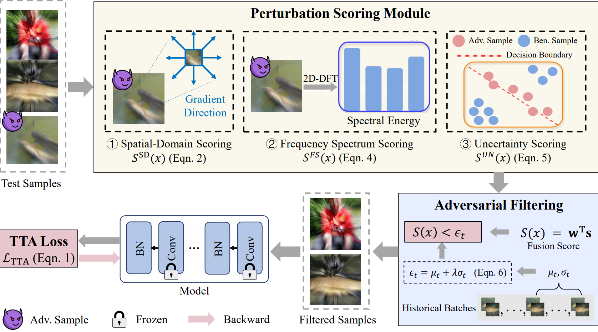

# 🛡️ ARTTA: Towards Adversarially Robust Test-Time Adaptation via Perturbation Detection

Official PyTorch implementation of **ARTTA**.

**ARTTA** is a plug-and-play framework designed to concurrently mitigate **distribution shifts** and **adversarial attacks**. By introducing a principled detection-and-filtering paradigm, ARTTA purifies the test-time data stream, preventing the unsupervised adaptation process from being poisoned by malicious samples.

------

## 💡 Key Contributions

- **1️⃣ Multi-Indicator Scoring (MIS):** A synergistic module that analyzes adversarial signatures across **Spatial**, **Spectral**, and **Uncertainty** domains.
- **2️⃣ Dynamic Thresholding (DT):** An adaptive strategy using a **sliding window of historical scores** to handle non-stationary test environments.
- **3️⃣ Plug-and-Play:** Seamlessly integrates with existing TTA methods (e.g., **TENT**, **EATA**, **SAR**) without architectural modifications.

------

## 🖼️ Method Overview




## 📁 Repository Structure

- `main.py`: Unified entry point for all experiments.
- `adv_filter.py`: Core implementation of ARTTA's adversarial detection logic.
- `tent.py`, `eata.py`, `sar.py`: Implementations of baseline TTA methods.
- `medbn.py`, `rbn.py`: Robust Batch Normalization implementations.
- `models/`: Support for various backbones (ResNet, ViT, etc.).
- `requirements.txt`: Environment dependencies.
- `sotta_utils/`: Implementation of the SoTTA baseline method and its supporting utilities.
- `CIFAR100-c/`: Contains scripts for fine-tuning and evaluating on the **CIFAR-100-C** corruption benchmark. Includes training, testing, and robustness check utilities.

## 🛠️ Installation

1. **Create Environment**:

   Bash

   ```
   conda create -n artta python=3.8 -y
   conda activate artta
   ```

2. **Install Dependencies**:

   Bash

   ```
   pip install -r requirements.txt
   ```


## 🚀 Dataset Preparation

Please download the datasets and organize them as follows. The folder names and structures are set to match the default `CONFIG` in the scripts.

### 1. Official Download Links

- **CIFAR-100-C:** [Zenodo Link](https://zenodo.org/record/3555552)
- **ImageNet-C:** [Zenodo Link](https://zenodo.org/records/2235448)

### 2. Directory Structure

Ensure your root directory has a `data/` or `datasets/` folder organized like this:

#### **For CIFAR-100-C Experiments**

The script `test_CIFAR100-c.py` expects the following path: `./data/CIFAR-100-C/`

Plaintext

```
./data/
└── CIFAR-100-C/             <-- Matches 'cifar100c_root'
    ├── labels.npy
    ├── gaussian_noise.npy
    ├── shot_noise.npy
    └── ... (other corruption files)
```

#### **For ImageNet-C Experiments**

The script expects paths categorized by corruption and severity:

Plaintext

```
./datasets/
└── imagenet-c/
    └── gaussian_noise/
        └── 3/               <-- Default severity level
            ├── [class_folders]
            └── ... 
```

### 3. Quick Check (Code Configuration)

If you place the files elsewhere, remember to update the `CONFIG` dictionary in your Python scripts:

- **CIFAR-100-C Path:** `config['cifar100c_root']`
- **Adversarial Data Path:** `config['adv_data']` (e.g., `./data/CIFAR-100-C-Adv/`)


## ⚙️ Configuration & Usage

To replicate our results or conduct new experiments, you only need to modify the `CONFIG` dictionary in `main.py`. This centralized configuration controls everything from dataset paths to defensive hyperparameters.

### 1. How to Run

After editing the parameters in `main.py`, run the unified entry point:

Bash

```
python main.py
```

### 2. Key Parameter Guide

Below are the most frequently adjusted fields in `CONFIG`:

#### 🛡️ Adversarial Attack Settings

- **`dia_attack['enabled']`**: Set to `True` to evaluate against **Distribution Invading Attacks (DIA)**.
- **`dia_attack['attack_ratio']`**: Controls the poisoning intensity (e.g., `0.2` means 20% of the stream is malicious).
- **`eps` & `steps`**: Define the budget ($L_{\infty}$) and iteration count for the adversarial perturbation.

#### 🧠 ARTTA Defensive Core

- **`adv_detection['std_factor']` ($\lambda$)**: The most critical hyperparameter for ARTTA's dynamic thresholding.
- **`feature_weights`**: Adjust the importance of different adversarial indicators: `[entropy, avg_grad_magnitude , gradient_direction_entropy, mean_spectrum]`.
- **`window_size`**: Defines the historical window for temporal statistical thresholding (default: `20`).

#### 🧪 Baselines & Models

- **`method`**: Choose your TTA baseline (e.g., `tent`, `eata`, `sar`, `sotta`).
- **`model`**: Support for various backbones including `resnet50`, `resnet101`.
- **`medbn`**: Enable Robust Batch Normalization by setting `enable: True`.


### 🚀 Reproduction (Quick Start)

We provide a unified `main.py` to evaluate the robustness of ARTTA. You can reproduce the core experimental results by adjusting the `config` dictionary or command-line arguments according to the following experiment settings:

| **Target**                  | **Key Parameter**         | **Description**                                              |
| --------------------------- | ------------------------- | ------------------------------------------------------------ |
| **DIA Attack Defense**      | `method`, `adv_detection` | Compare ARTTA with MedBN and SoTTA under online DIA attacks. |
| **Adversarial Ratio**       | `attack_ratio`            | Evaluate robustness across ratios $\in$ {10%, 20%, 40%, 60%}. |
| **Attack Intensity**        | `steps`                   | Assess defense under iterative steps $N \in$ {1, 5, 10, 20}. |
| **Coefficient Sensitivity** | `feature_weights`         | Optimize weights for Spatial (SD), Spectral (FS), and Uncertainty (UN). |
| **Window Stability**        | `window_size`             | Verify stability across window sizes $W \in$ {5, 10, 20, 30}. |
| **Threshold Sensitivity**   | `std_factor` ($\lambda$)  | Record metrics (AUROC, F1) as $\lambda$ varies $\in$ {0.0, 0.3, 0.6, 0.9}. |
| **Batch Size Robustness**   | `batch_size`              | Evaluate performance across batch sizes $\in$ {32, 64, 100, 128}. |


#### 💡 Dynamic Optimization Tips:

To achieve the best defensive performance under different attack ratios, we suggest following this empirical guidance for the threshold factor `std_factor` ($\lambda$):

**60% Attack Ratio**: Set `std_factor` to `-0.2`.

**40% Attack Ratio**: Set `std_factor` to `0.3`.

**20% Attack Ratio**: Set `std_factor` to `0.9`.

**10% Attack Ratio**: Set `std_factor` to `1.6`.


## 

## 📜 License

This project is currently released for **academic research purposes only**.

The specific open-source license is pending confirmation with the research team. If you wish to use this code for commercial purposes or have any inquiries regarding licensing, please contact the author through the email address associated with the paper or open an issue in this repository.
