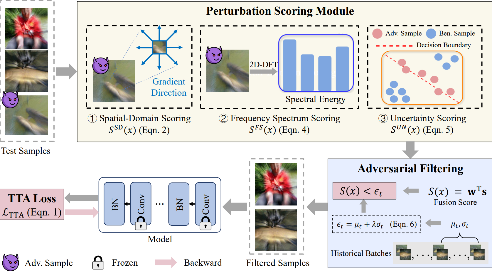

# 🛡️ ARTTA: Towards Adversarially Robust Test-Time Adaptation via Perturbation Detection

Official PyTorch implementation of **ARTTA**.

ARTTA is a plug-and-play test-time adaptation framework that detects and filters adversarial samples before they poison online adaptation. It is designed to improve robustness under both **distribution shifts** and **adversarial attacks** without requiring architectural changes to the underlying TTA method.

## 💡 Overview

ARTTA combines three components:

- **Multi-Indicator Scoring (MIS):** analyzes adversarial signatures from **uncertainty**, **spatial**, and **frequency** domains.
- **Dynamic Thresholding (DT):** uses a sliding window of historical scores to adapt the detection threshold online.
- **Plug-and-Play Integration:** works with existing TTA methods such as **TENT**, **EATA**, **SAR**, and related normalization-based variants.

In the online test stream, ARTTA scores each incoming sample, identifies suspicious inputs, filters them before adaptation, and then updates the model using the remaining samples.

## 🖼️ Method Overview



Pipeline summary:

- **Input:** corrupted or adversarial test stream
- **Detection:** feature scoring across uncertainty, spatial, and spectral domains
- **Filtering:** dynamic thresholding identifies suspicious samples
- **Adaptation:** only retained samples are used for test-time adaptation

## 📁 Repository Structure

- `main.py`: unified entry point for evaluation and adaptation experiments
- `adv_filter.py`: ARTTA detector, multi-feature scoring, and thresholding logic
- `tent.py`, `eata.py`, `sar.py`: baseline TTA methods
- `medbn.py`, `rbn.py`: robust normalization modules
- `models/`: backbone model definitions
- `sotta_utils/`: utilities for the SoTTA baseline
- `CIFAR100-c/`: scripts for CIFAR-100-C fine-tuning, testing, and robustness checks
- `requirements.txt`: Python dependencies

## 🛠️ Environment

- **Python:** 3.8
- **PyTorch:** 2.0.1
- **CUDA:** 11.8 recommended
- **Hardware:** 24 GB VRAM recommended for large-scale reproduction

## ⚙️ Installation

```bash
conda create -n artta python=3.8 -y
conda activate artta
pip install -r requirements.txt
```

## 🚀 Quick Start

1. Install the environment and dependencies.
2. Download the dataset and place it in the expected directory.
3. Edit the `CONFIG` dictionary in `main.py`.
4. Run:

```bash
python main.py
```

Current releases use an in-file `CONFIG` dictionary in `main.py` rather than a full command-line interface, so most experiments are configured by editing that file directly.

## 📦 Dataset Preparation

Download the required datasets and place them under the paths expected by the code.

### 🔗 Official Links

- **CIFAR-100-C:** [Zenodo](https://zenodo.org/record/3555552)
- **ImageNet-C:** [Zenodo](https://zenodo.org/records/2235448)

### 📂 Expected Directory Layout

For **CIFAR-100-C** experiments:

```text
./data/
└── CIFAR-100-C/
    ├── labels.npy
    ├── gaussian_noise.npy
    ├── shot_noise.npy
    └── ...
```

For **ImageNet-C** experiments:

```text
./datasets/
└── imagenet-c/
    └── gaussian_noise/
        └── 3/
            ├── class_1/
            ├── class_2/
            └── ...
```

If your local dataset paths differ from the defaults, update the corresponding entries in `CONFIG`, especially:

- `config['cifar100c_root']`
- `config['adv_data']`
- any ImageNet-C path entries used by your experiment setup

## ⚙️ Configuration Guide

Most experiments are controlled through the `CONFIG` dictionary in `main.py`.

### 🧩 Core Settings

- `method`: TTA method to run, such as `tent`, `eata`, `sar`, or `sotta`
- `model`: backbone architecture, such as `resnet50` or `resnet101`
- `batch_size`: evaluation batch size
- `tta_iterations`: number of adaptation steps per batch

### 🛡️ Adversarial Attack Settings

- `dia_attack['enabled']`: enable or disable DIA generation
- `dia_attack['attack_ratio']`: fraction of the stream replaced with adversarial inputs
- `dia_attack['attack_type']`: attack type used by DIA
- `dia_attack['eps']`: perturbation budget
- `dia_attack['steps']`: number of iterative attack steps

### 🧠 ARTTA Detection Settings

- `adv_detection['enabled']`: enable ARTTA detection
- `adv_detection['window_size']`: sliding window size for threshold estimation
- `adv_detection['threshold_method']`: thresholding rule, such as `std` or `quantile`
- `adv_detection['std_factor']`: threshold coefficient for standard deviation-based thresholding
- `adv_detection['feature_weights']`: feature fusion weights in the order `[entropy, avg_grad_magnitude, gradient_direction_entropy, mean_spectrum]`

### 🧪 Robust Normalization

- `medbn['enable']`: enable robust batch normalization variants when supported

## 🚦 Example Experiment Workflow

For a typical CIFAR-100-C robustness run:

1. Set the dataset root in `main.py`.
2. Choose a baseline such as `method='tent'`.
3. Enable ARTTA with `adv_detection['enabled'] = True`.
4. Enable DIA with `dia_attack['enabled'] = True`.
5. Set `attack_ratio`, `eps`, `steps`, and `std_factor`.
6. Run `python main.py`.

## 🧪 Reproduction Targets

The following settings are the main axes explored in ARTTA experiments:

| Target | Key Parameter | Description |
| --- | --- | --- |
| DIA attack defense | `method`, `adv_detection` | Compare ARTTA against baseline TTA pipelines under online DIA attacks |
| Adversarial ratio | `attack_ratio` | Evaluate robustness under different malicious stream ratios |
| Attack intensity | `steps` | Measure robustness under stronger iterative attacks |
| Coefficient sensitivity | `feature_weights` | Study the contribution of uncertainty, spatial, and spectral features |
| Window stability | `window_size` | Test sensitivity to temporal threshold window size |
| Threshold sensitivity | `std_factor` | Measure AUROC, F1, and related detection metrics across thresholds |
| Batch size robustness | `batch_size` | Evaluate adaptation quality under different online batch sizes |


## 📊 Outputs

Depending on the experiment setup, the code reports metrics such as:

- benign top-1 accuracy
- benign error rate
- detector AUROC
- detector FPR@TPR95
- adaptation-time logging for suspicious-sample filtering

If you add custom logging or save directories in `main.py`, make sure the output path exists or is created before evaluation.


## 📜 License

This repository is currently provided for **academic research use only**.

A standard open-source license has not yet been assigned. For commercial use, redistribution, or other licensing questions, please contact the authors or open an issue in this repository.
